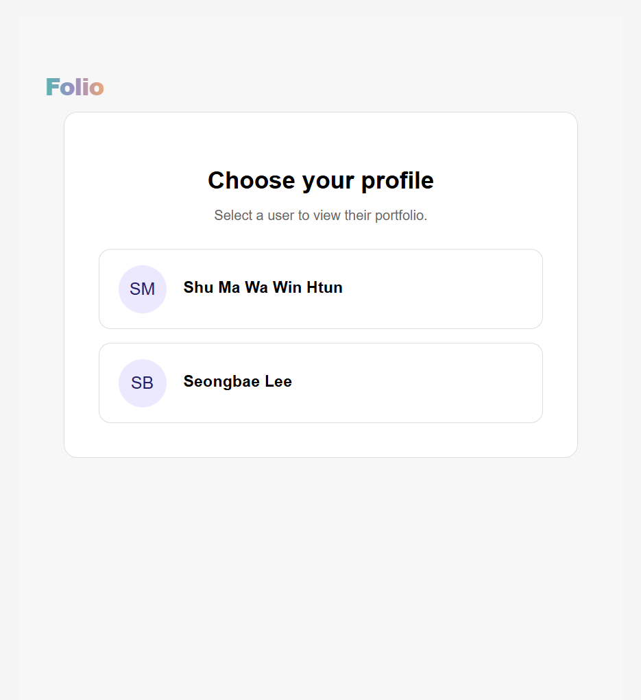
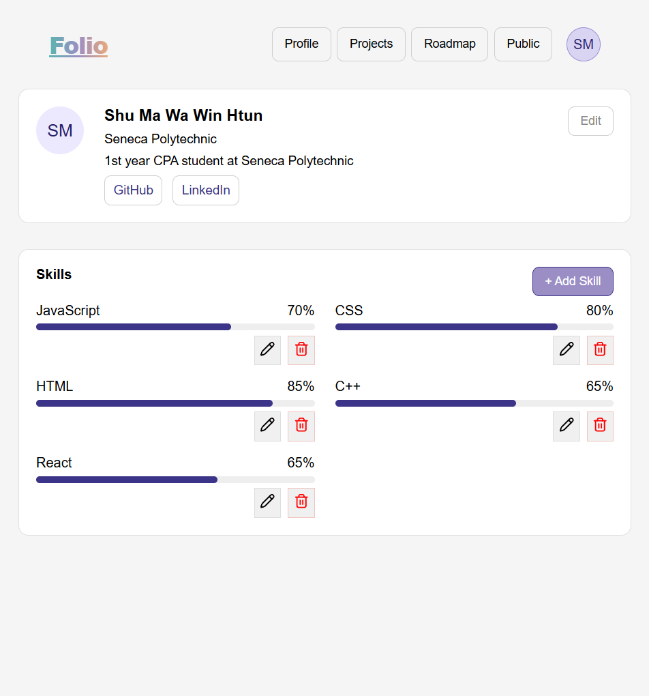
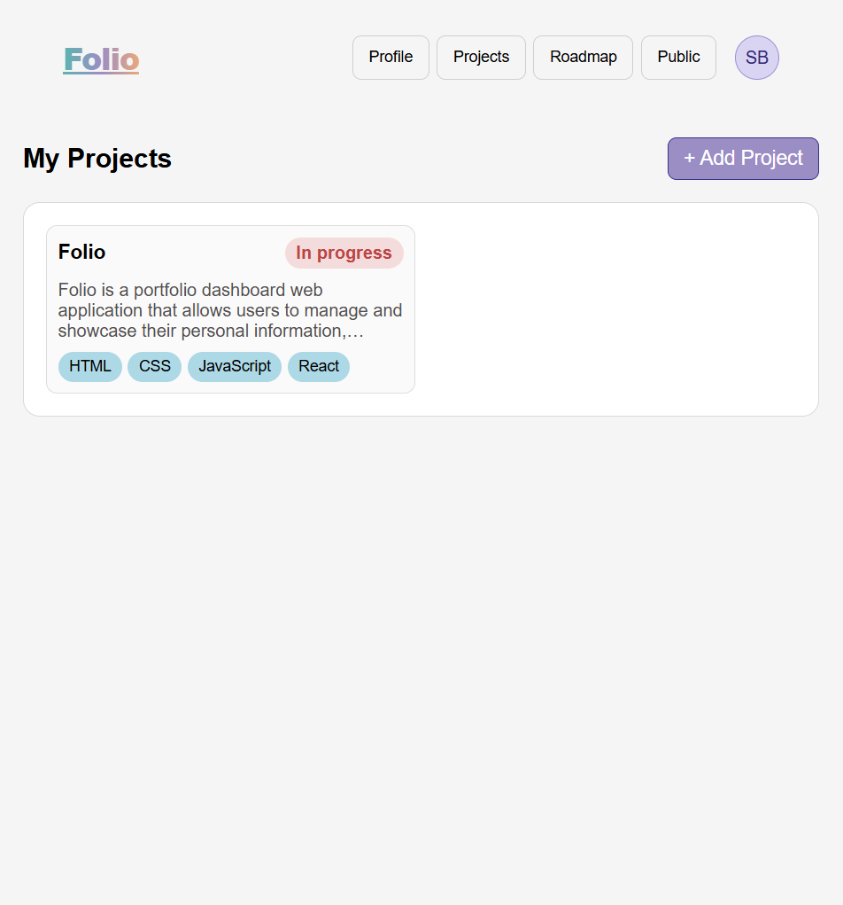
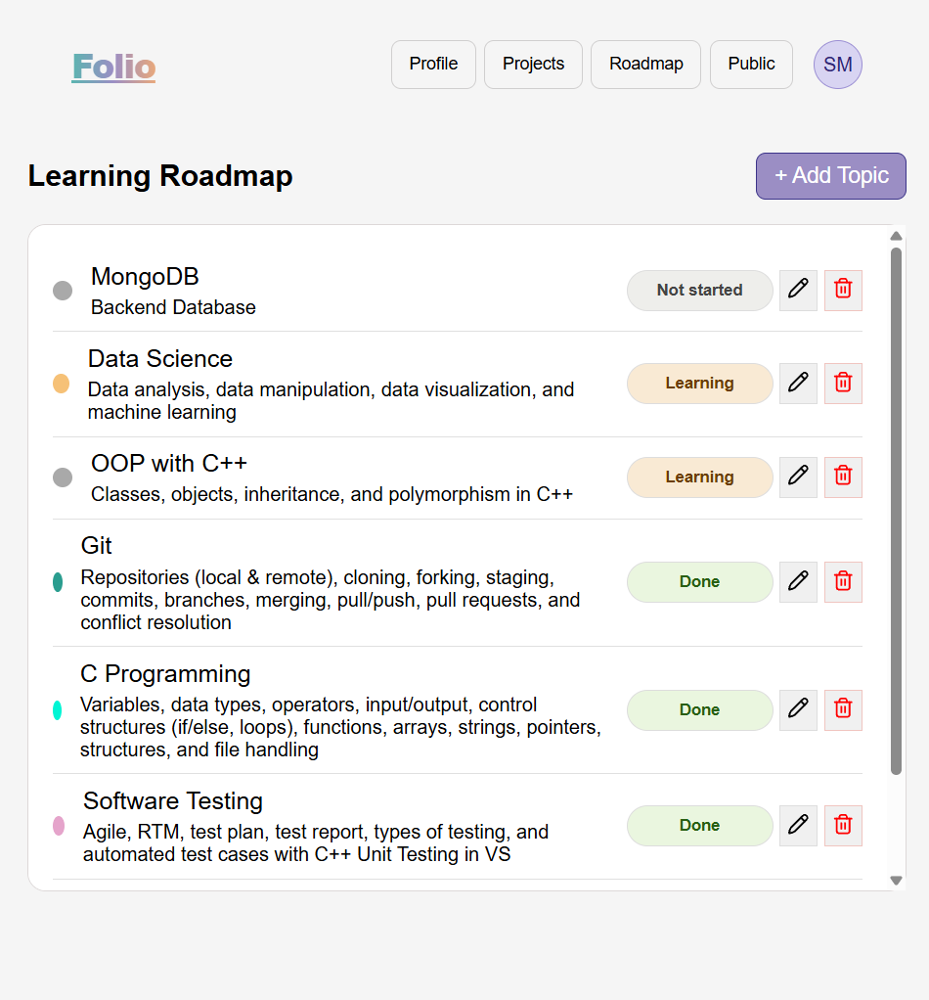
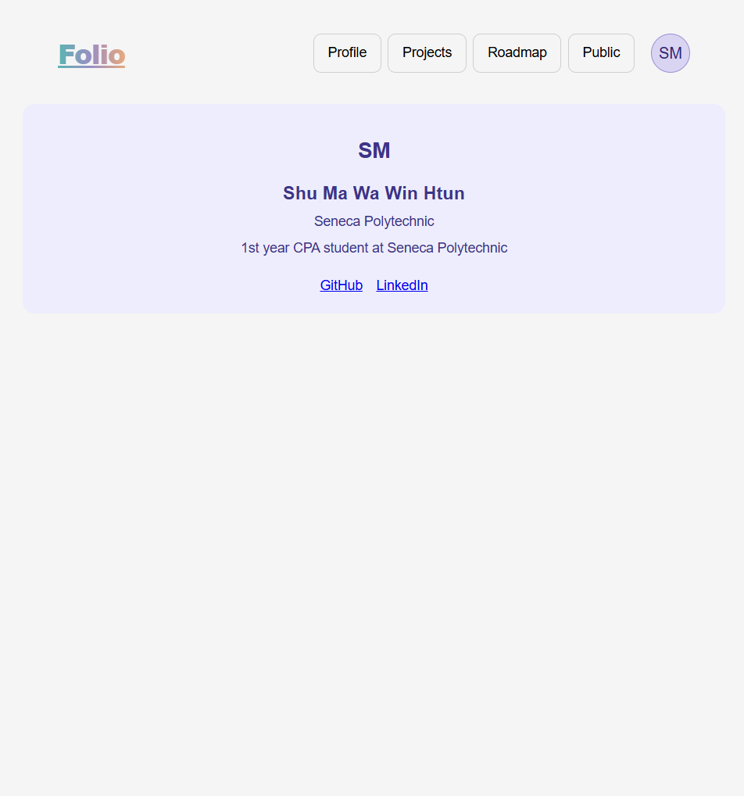

# Folio

## Overview
Folio is a portfolio dashboard web application that allows users to manage and showcase their personal information, projects, and learning progress in one place.

It is designed with a clean and simple UI to build a portfolio system similar to real-world applications.

---

## Purpose
This project was built to:

- Practice React frontend development
- Understand state management and component structure
- Simulate a real-world portfolio system
- Gain experience with API integration using MockAPI

---

## Live Demo
[Folio](https://folio-ten-beryl.vercel.app/)

---

## Features
- User Selection  
  Select a user profile to view personalized portfolio data

- Profile Page  
  Displays user information such as name, school, bio, and external links

- Projects Page  
  View, add, edit, and delete projects  
  Organize projects using tags

- Roadmap Page  
  Track learning progress  
  Add, update, and manage learning topics

- Public Page  
  Provides a clean public-facing version of the portfolio

---

## Screenshots

### User Selection

### Profile Page

### Projects Page

### Roadmap Page

### Public Page

---

## Tech Stack

Frontend
- HTML
- CSS
- JavaScript
- React

Backend
- MockAPI (REST API simulation)

---

## What We Learned
- Managing state using React Hooks (useState, useEffect, useRef)
- Performing CRUD operations with API
- Structuring components using props
- Handling dynamic UI updates using map() and conditional rendering

---

## Limitations / Future Improvements
- No authentication system (login/signup not implemented)
- Uses MockAPI instead of a real backend
- Limited to a single resource due to free-tier constraints

---

## Architecture
- Single Page Application (SPA)
- Component-based structure
- REST API communication using Axios
